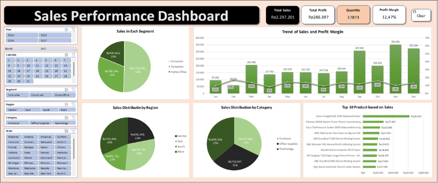

# Sales Analytics Dashboard

## Dashboard Preview

## Overview

An interactive **Sales Analytics Dashboard** developed using Microsoft Excel to analyze sales performance, profitability, customer segments, regional performance, product categories, monthly trends, and top-performing products.

The dashboard is built from **9,994 sales transaction records** and uses Pivot Tables, Pivot Charts, Excel formulas, and Slicers to transform transaction-level data into an interactive reporting view.

## Dashboard KPIs

| KPI | Result |
|---|---:|
| Total Sales | 2,297,200.86 |
| Total Profit | 286,397.02 |
| Quantity | 37,873 |
| Profit Margin | 12.47% |

## Analysis

The dashboard provides analysis across:

- Monthly Sales & Profit Margin Trend
- Sales by Customer Segment
- Sales by Region
- Sales by Product Category
- Top 10 Products by Sales

## Key Insights

- **Consumer** was the largest customer segment, contributing approximately **50.56% of total sales**.
- **West** was the highest-performing region, contributing approximately **31.58% of total sales**.
- **Technology** was the highest-performing product category, contributing approximately **36.40% of total sales**.
- **November** recorded the highest monthly sales at **352,461.07**.
- **February** recorded the highest monthly profit margin at approximately **17.23%**.
- **April** recorded the lowest monthly profit margin at approximately **8.41%**.
- **Canon imageCLASS 2200 Advanced Copier** was the top-selling product in the Top 10 Products analysis, generating **61,599.82 in sales**.

## Data & Analysis Process

### Raw Dataset

The dashboard was developed from transaction-level sales data containing order, customer, geographic, product, category, quantity, sales, and profitability-related information.

### PivotTable Analysis

PivotTables were used to aggregate and analyze sales performance across customer segments, regions, product categories, products, and monthly trends.

## Dashboard Features

- Interactive **Month Slicer** for filtering the dashboard
- KPI cards for Total Sales, Total Profit, Quantity, and Profit Margin
- Monthly sales and profit margin trend analysis
- Customer segment sales analysis
- Regional sales analysis
- Product category sales analysis
- Top 10 product sales analysis

## Tools & Techniques

### Tools

- Microsoft Excel

### Excel Features & Techniques

- Pivot Table
- Pivot Chart
- Slicer
- Excel Formulas
- Data Preparation
- Data Analysis
- Data Visualization
- Dashboard Development
- Trend Analysis
- KPI Analysis
- Reporting

## Project Outcome

Developed an interactive Excel dashboard that consolidates sales, profitability, customer, regional, category, and product performance into a single reporting view. The dashboard supports clearer performance monitoring and data-driven interpretation of sales data.

## Repository Contents

- `Case Study 2 - Sales Analytics Dashboard_Dhandy Syahmai Pattiasina. S. Mat.xlsm` — Excel dashboard and supporting workbook.
- `Dashboard_Preview.png` — Dashboard preview.
- `Raw Data_Preview.png` — Raw transaction data preview.
- `Pivot Analysis_Preview.png` — PivotTable analysis preview.

## Author

**Dhandy Syahmai Pattiasina**  
Bachelor of Mathematics, Universitas Diponegoro
